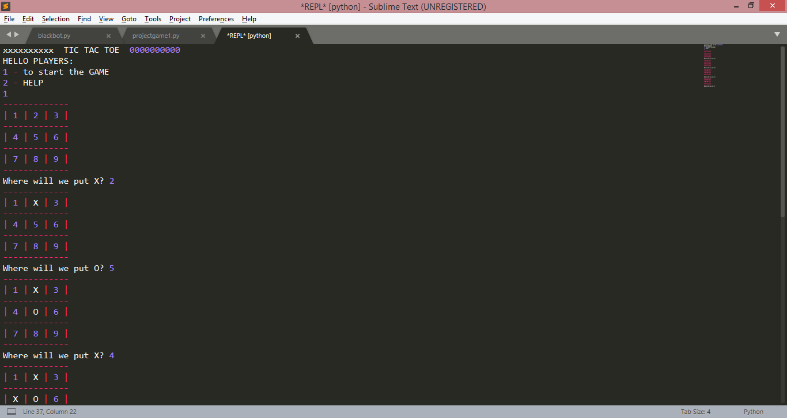
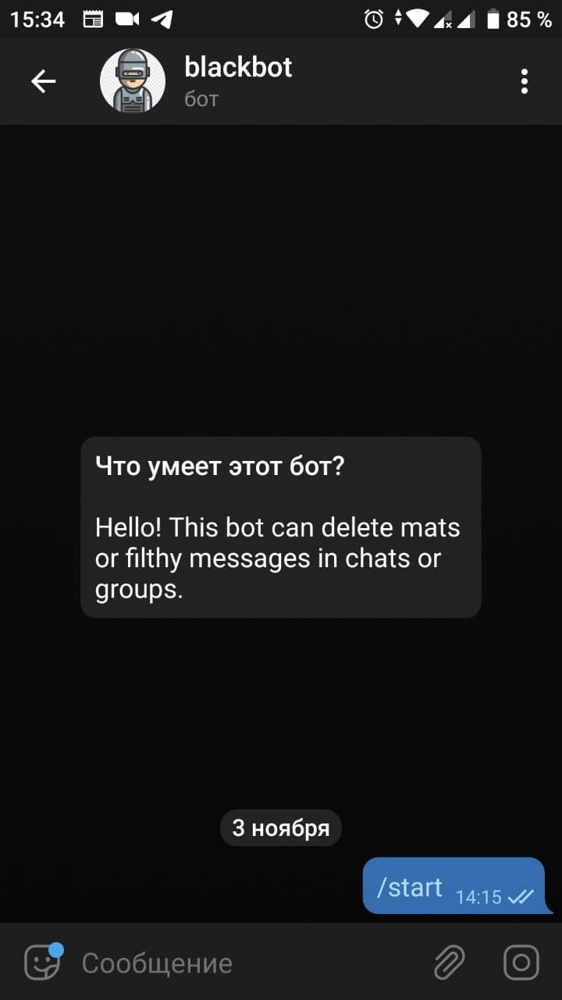

# Tic Tac Toe
It's console game for two players, without graphical interface.
Tic-tac-toe (American English), noughts and crosses (Commonwealth English), or Xs and Os, is a paper-and-pencil game.
### No need to library Installations

## Screenshot of game




# Telegram bot
Most of people use filthy words in chats. 
#### This bot may help you. It's bot that deletes mats or filthy words in chats.



## Library
Use the package manager [pip](https://pip.pypa.io/en/stable/) to install *telebot* library.

```bash
pip install pytelegrambotapi
```

## Usage

```
You have to use your own bot token. You have to add this bot to group, and give it admin rights.
Also you have to write your group's name in code, 8th line.
```


## Regards, *Nazim Mukhtarbekov*
